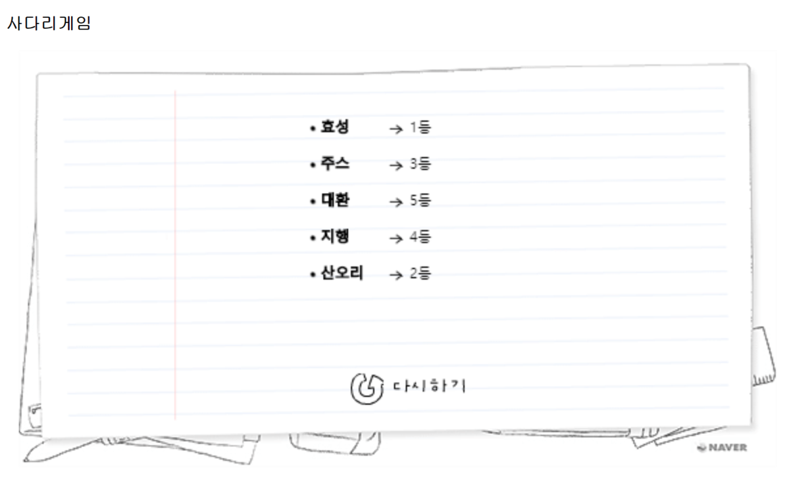

# CodejamKicstartStudy
코드잼 킥스타트 스터디 자료 공유를 위한 레포지토리 입니다.

# 발표 순서
1주에 한 사람씩 돌아가면서 발표를 진행합니다.
발표 순서 : 효성 -> 산오리 -> 주스 -> 지행 -> 대환

screenshot

# 저장소 사용 방식
 - issue page 에선 발표 일정과 스터디할 문제를 공지를 합니다.
 - 발표 자료 및 공유할 자료들은 docs 폴더를 이용합니다.