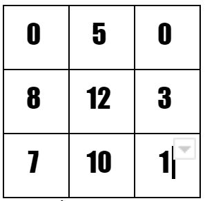
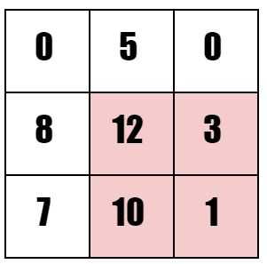
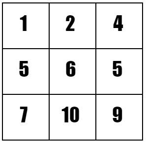
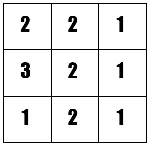

# 문제 설명

문제 링크 : [2019_Round_C_2_Circuit Board](https://codingcompetitions.withgoogle.com/kickstart/round/0000000000050ff2/0000000000150aae)

3개의 정수 R, C, K를 입력 받는다.
R x C 행렬을 입력 받는다.
Ex) R = 3, C = 3, K = 2

선택할 수 있는 모든 subrectangle 중 good subrectangle 인 것 중에서 크기가 가장 큰 것의 크기는 얼마인가?

subrectangle 이란?

(ex. 색칠 된 곳 처럼 행렬 안에서 부분 행렬 선택)

good subrectangle 이란?

각 row 에 대해 다음 조건을 만족 해야 한다.

(해당 row에서 최대값) - (해당 row에서 최소값) <= K

위에 색칠한 예시는 good subrectangle 이 아니다.

Limits
1 <= T <= 50 (Test Case)

1 <= R <= 300

1 <= C <= 300

0 <= Vij <= 1000 (행렬 안에 들어가는 값)

Test Set1
	K = 0

Test Set2
	0 <= K <= 1000

# 풀이 설명

R <= 300 이고 C <= 300 이므로 행렬 최대 크기는 90000.

(n = 300 이라고 치자.)

O(n^4) 이상은 모두 Time limit 에 걸린다.

O(n^3) 이하여야 할듯.

O(n^3) 이면 행렬 한번 쭉 보면서 각 cell 마다 n번씩 뭔가를 할 수 있는 정도의 여유.

행렬 한번 쭉 돌면서 각 cell 마다 n 번의 연산으로 다음과 같은 작업을 하자.

(3중 루프 - O(n^3))

(i, j) 번째 cell 에서 연산.

(i, j) ~ (i, C) 까지 중 (i, j) 는 어디까지 확장 될 수가 있나? 이 값(확장 될 수 있는 최대 길이)을 저장해 둔다.

확장 가능 하다는 말은 "(최대값) - (최소값) <= K" 를 의미.

또 한번 3중 루프(O(n^3)) 를 다음과 같이 돌자.

(i, j) 번째 cell 에서 연산.

(i, j) ~ (R, j) 까지 루프를 돈다.

루프를 돌면서 위에 3중 루프에서 구한 값들을 이용하여 (i, j) 를 left top 으로 하는 good subretangle 의 최대 크기를 구한다.

각 cell 을 left top 으로 하는 good subretangle 으이 최대 크기(정답이 될 수 있는 후보 녀석들)를 구했다.

이 중에서 최대 값이 정답.

Ex) R = 3, C = 2, K = 2

일 때 다음 값을 계산(첫 번째 3중 루프)

