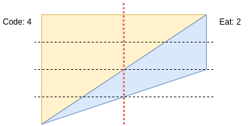
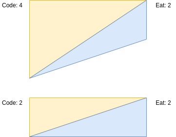

# Round E 2019

## Problem B: Code-Eat Switcher
* [Kickstart Source](https://codingcompetitions.withgoogle.com/kickstart/round/0000000000050edb/00000000001707b8)

### Problem
하루 timeslot 별로 code, eat의 효율성이 주어졌을 때, code, eat 총량의 요구조건을 달성할 수 있는지 판별(decide)하라

* 효율성 예시
  | Slot | Code | Eat |
  |-----:|-----:|----:|
  | 1    | 3    | 8   |
  | 2    | 6    | 10  |

### 풀이 방법
* One slot case

  
  - 요구조건을 달성할 수 있는 비율(ratio)을 찾기

* Two slots case

  
  - code<i>i</i> / eat<i>i</i> >= 
  code<i>j</i> / eat<i>j</i>
  라면 Slot i를 code를 할당하는 데 사용

* n-slots case
  - code<i>i</i> / eat<i>i</i> 의 순서대로 정렬
  - code 비율이 많은 순으로 code 요구조건을 할당 (binary search)
  - 남은 slot과 비율로 eat 요구조건을 달성하는지에 따라 가능 불가능을 결정